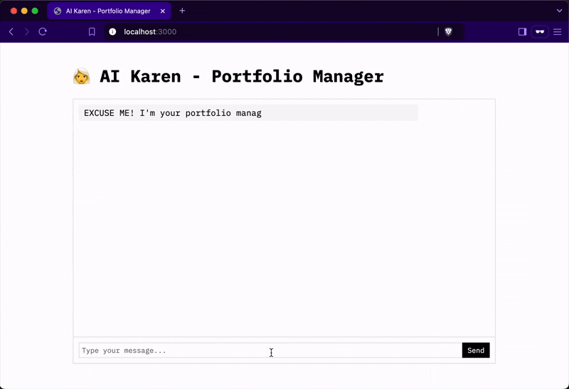

# Demo



# Portfolio Manager

```tree
Directory structure:
└── ./public/
    ├── index.html                           # Chat interface
└── ./src/
    ├── _setup.ts                            # Setup PKP
    ├── server.ts                            # Chat server
    ├── _env.ts
    ├── agent/
    │   └── ai-agent.ts                      # AI Agent
    ├── config/
    │   └── portfolio-data.json              # PKP portfolio data
    |   └── user-preference.json             # User strategy settings
    |   └── delegation.ts
    ├── vendors/
    │   └── lit-service.ts
    ├── backend/
    │   └── lit-action.ts                    # Lit Actions
    │   ├── layers/
    │   │   ├── utils/
    │   │   │   ├── la-token-list.ts         # Available tokens
    │   │   │   └── la-utils.ts
    │   │   └── la-portfolio/                # Part 1 - get the PKP portfolio
    │   │   │   └── la-get-portfolio.ts
    │   │   ├── la-strategies/               # Part 2 - Select strategies
    │   │   │   ├── la-aggregated-orders.ts
    │   │   │   ├── la-instructions.ts
    │   │   │   ├── la-optimized-paring.ts
    │   │   │   └── la-full-matrix.ts
    │   │   ├── la-trade-execution/          # Part 3 - Broadcast transactions
    │   │   │   ├── la-trade-executor.ts
    │   │   │   └── la-token-price.ts
    ├── frontend/
    │   ├── index.ts                         # Main entry point
    │   ├── get-portfolio.ts
    │   ├── wrap.ts                          # Wrap WETH to trade
    │   └── unwrap.ts                        # Unwrap WETH
    ├── utils/
    │   ├── types.ts
    └   └── silent.ts
```
